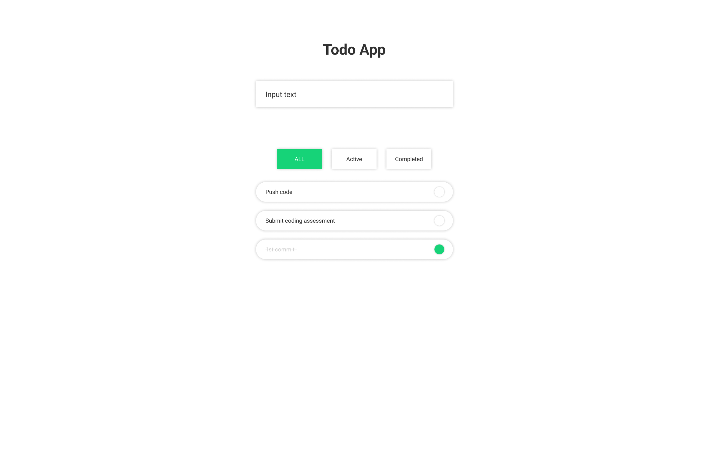
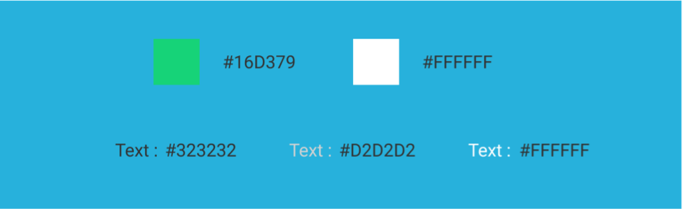

# todo-list-react-ts

**English** | [简体中文](README.zh-CN.md)

- [todo-list-react-ts](#todo-list-react-ts)
  - [Subject](#subject)
  - [Instructions](#instructions)
    - [Todo App (Example)](#todo-app-example)
    - [Components (Must)](#components-must)
    - [Colors (Must)](#colors-must)
  - [Requirements](#requirements)
    - [Out of Scope](#out-of-scope)
    - [Requirements list(Must)](#requirements-listmust)
    - [Requirement about Tech](#requirement-about-tech)
    - [Optional Requirements](#optional-requirements)
  - [How to submit](#how-to-submit)

## Subject

To create a todo application.

## Instructions

At minimum, applicants should make use of all **components** and **colors** listed below when building the Todo App. Apart from that you are free to choose the style/design however you best see fit.

### Todo App (Example)

### Components (Must)

### Colors (Must)

## Requirements

### Out of Scope

To be out of scope in terms of Coding Assessment.

- Users (it is not necessary to be able to create a separate todo for each user).
- Persistence of data using API or DB(NOT forbid you to use it).
- Deleting and updating TODO.

### Requirements list(Must)

1. You can create a TODO (The status at the time of creation is Completed.)
  - TODO is created by typing the text and clicking `Enter`.
2. Created data will be stored in the store(global state management).
3. Each TODO has two statuses, `active` and `completed`.
4. The list of created TODOs can be displayed.
  The order of the list is
   - `active` is first, `completed` is second.
   - Next order is the order of `creation` (the last todo created will be displayed at the top).
1. By clicking on the created TODO, you can change the status from `active` to `completed`.
2. Once a TODO is `completed`, it cannot be changed to `active`.
3. The list of TODO can be filtered by the following conditions.
   - No filtering.
   - Show only `active` items.
   - Show only `completed` items.

### Requirement about Tech

1. Use `React`. (Use `Preact`, `Next.js` is also ok)
2. Use `TypeScript`.
3. NOT use UI library(e.g `Material UI`, `Bootstrap`). But to use css framework (e.g `styled-component`, `css-in-module`, `vanilla-extract`, `Tailwind`) are ok.

### Optional Requirements

We welcome the opportunity to see the code you implement in a wider variety of contexts, although meeting many optional requirements is not always worth the points.

- Animation
- Infinite scrolling or pagination
- Unit Testing, Snapshot Testing, E2E Testing

## How to submit

If possible, please upload source code on some repository(e.g `github`, `gitlab`, `bitbucket`).
